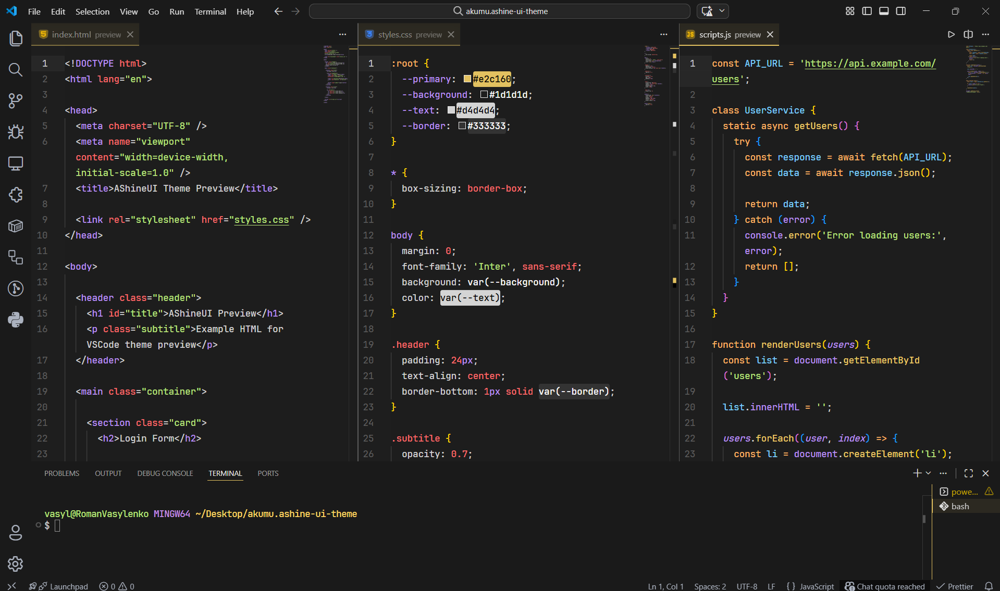
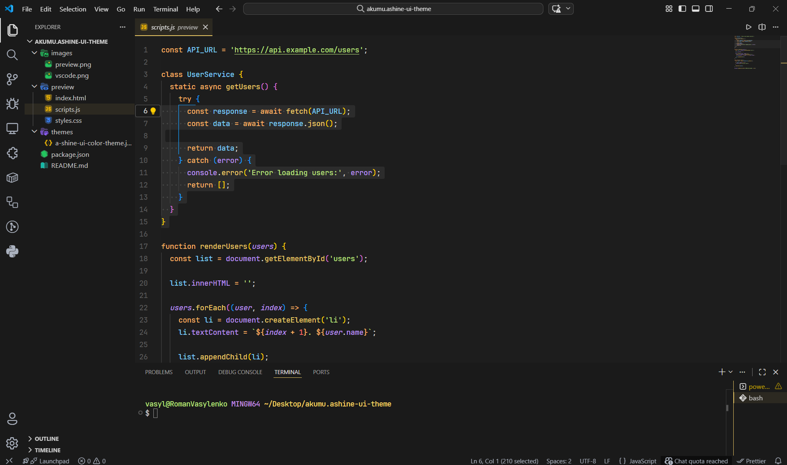

# AShineUI

A modern **dark theme for Visual Studio Code** designed for comfortable long coding sessions.

AShineUI focuses on **balanced contrast, soft syntax highlighting and clean UI colors** so your eyes don't get tired during long development sessions.

---

## ✨ Features

- Modern dark interface
- Soft syntax highlighting
- Carefully balanced color palette
- Custom terminal ANSI colors
- Full UI theming (sidebar, tabs, notifications, git decorations)
- Optimized for JavaScript / TypeScript / React

---

## 🎨 Color Palette

| Element    | Color     |
| ---------- | --------- |
| Background | `#1d1d1d` |
| Sidebar    | `#1a1a1a` |
| Accent     | `#e2c160` |
| Foreground | `#d4d4d4` |

### Syntax colors

| Token     | Color     |
| --------- | --------- |
| Keywords  | `#ffb464` |
| Variables | `#bd93f9` |
| Strings   | `#bae67e` |
| Numbers   | `#ff6b6b` |
| Functions | `#eecb66` |
| Types     | `#7dcfff` |
| Comments  | `#7f848e` |

---

## 🖥 Terminal Colors

AShineUI includes a custom ANSI palette for the integrated terminal.

| Color   | Value     |
| ------- | --------- |
| Red     | `#ff5555` |
| Green   | `#bae67e` |
| Yellow  | `#ffd866` |
| Blue    | `#7aa2f7` |
| Magenta | `#c792ea` |
| Cyan    | `#5ccfe6` |
| White   | `#e5e5e5` |

---

## 📸 Preview

### Editor



### Syntax Highlighting



---

## 📦 Installation

### From VSIX

1. Download the `.vsix` file
2. Open **VS Code**
3. Press:

```
Ctrl + Shift + P
```

4. Run:

```
Extensions: Install from VSIX
```

5. Select the theme file

---

## 🚀 Activating the Theme

Open command palette:

```
Ctrl + Shift + P
```

Run:

```
Preferences: Color Theme
```

Select:

```
AShineUI
```

---

## 🛠 Development

Build extension:

```
vsce package
```

Install locally:

```
code --install-extension ashine-ui-theme-0.0.3.vsix
```

---

## 🔗 Repository

https://github.com/Akumuuu/AShineUI

---

## 📄 License

MIT License
